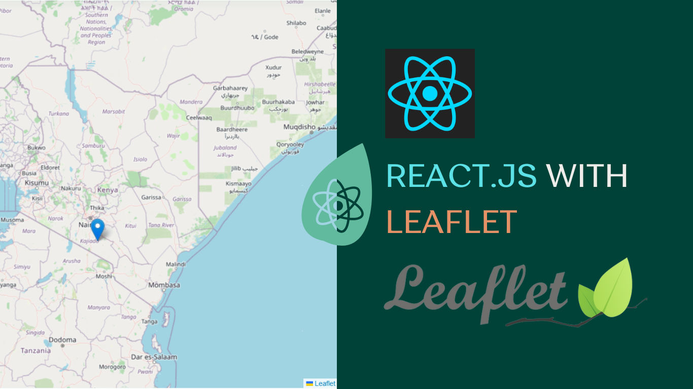

# Mapping the World with React and Leaflet 🗺️🌿



Welcome to the "Mapping the World with React and Leaflet" repository! 🚀🔍 This repository contains the code for an upcoming captivating article series that explores the powerful combination of Leaflet.js and React to create interactive maps and geospatial web applications.

## Article Series Overview 📚

In this series, we embark on an exciting journey of map visualization using Leaflet.js and React. From rendering a simple map to adding markers, polygons, and handling user interactions, we cover the art of geospatial web development step by step. Perfect for developers of all levels, the series offers insights into customizing maps, working with external data, and adding interactivity.

## Article Series Index 🗂️

1. [Render a Simple Map](https://example.com/article-1) - *Available Now!*
2. [Adding Markers and Popups](https://example.com/article-2) - *Coming Soon!*
3. [Zooming, Panning, and Map Controls](https://example.com/article-3) - *Coming Soon!*
4. [Interactive Features: Polygons, Lines, and Circles](https://example.com/article-4) - *Coming Soon!*
5. [Working with External Data: GeoJSON, KML, and Shapefiles](https://example.com/article-5) - *Coming Soon!*
6. [Customizing Popups, Styling, and Interactivity](https://example.com/article-6) - *Coming Soon!*
7. [Handling Map Events and User Interactions](https://example.com/article-7) - *Coming Soon!*

## Getting Started 🚀

To follow along with the examples and explore the code, clone this repository to your local machine using the following command:

```
git clone https://github.com/timndichu/mapping-world-with-react-and-leaflet.git
```


## Contributing 🤝

Found a bug, have a suggestion, or want to contribute improvements? We welcome your contributions! Feel free to open issues or submit pull requests.

## Acknowledgments 🙏

A huge thank you to the wonderful community of developers and the creators of React and Leaflet for making this series possible!

## License 📜

This project is licensed under the MIT License - see the [LICENSE](https://example.com/LICENSE) file for details.

Stay tuned for the upcoming articles and happy mapping! 🗺️🌿🌍

---

Feel free to personalize the URLs, article descriptions, and other details in the Readme to match your specific project. The Readme should provide a clear overview of the project, how to run the code (if applicable), and encourage contributions from the community. It also acts as a teaser for the upcoming articles, keeping readers excited and looking forward to the series' future content.